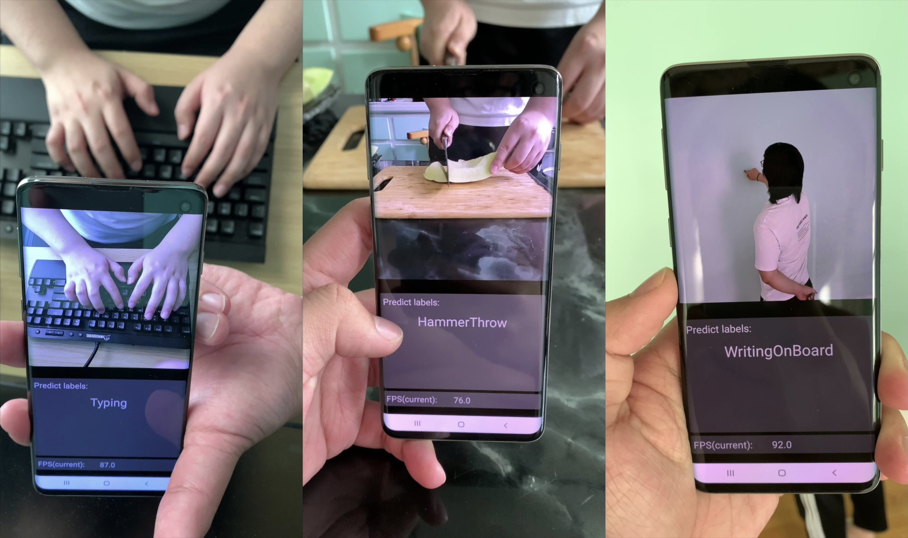

Mobile devices are becoming an important carrier for deep learning tasks, as they are being equipped with powerful, high-end mobile CPUs and GPUs. However, it is still a challenging task to execute 3D Convolutional Neural Networks (CNNs) targeting for real-time performance, besides high inference accuracy. The reason is more complex model structure and higher model dimensionality overwhelm the available computation/storage resources on mobile devices. A natural way may be turning to deep learning weight pruning techniques. However, the direct generalization of existing 2D CNN weight pruning methods to 3D CNNs is not ideal for fully exploiting mobile parallelism while achieving high inference accuracy.

This paper proposes RT3D, a model compression and mobile acceleration framework for 3D CNNs, seamlessly integrating neural network weight pruning and compiler code generation techniques. We propose and investigate two structured sparsity schemes i.e., the vanilla structured sparsity and kernel group structured (KGS) sparsity that are mobile acceleration friendly. The vanilla sparsity removes whole kernel groups, while KGS sparsity is a more fine-grained structured sparsity that enjoys higher flexibility while exploiting full on-device parallelism. We propose a reweighted regularization pruning algorithm to achieve the proposed sparsity schemes. The inference time speedup due to sparsity is approaching the pruning rate of the whole model FLOPs (floating point operations). RT3D  demonstrates up to 29.1$$\times$$ speedup in end-to-end inference time comparing with current mobile frameworks supporting 3D CNNs, with moderate 1%$$\sim$$1.5% accuracy loss. The end-to-end inference time for 16 video frames could be within 150 ms, when executing representative C3D and R(2+1)D models on a cellphone. For the first time, real-time execution of 3D CNNs is achieved on off-the-shelf mobiles.

